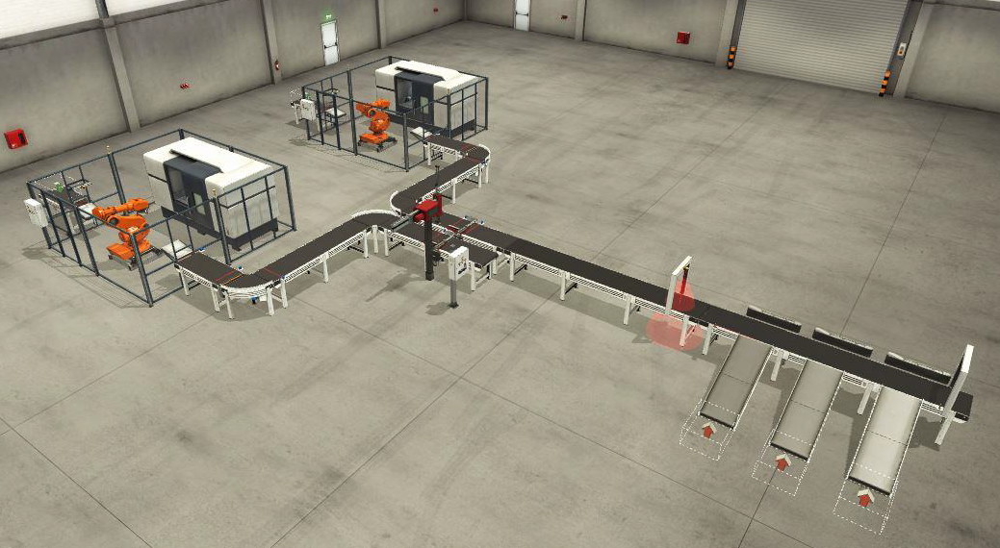

# Factory IO

The assumption of the project is to visualize the selected production process and create dedicated software. The Siemens controller and TIA Portal software were used to program the simualtion in Factory IO.

The production process was based on the production of bases and lids from separate production stations, the assembly process of them and sorting by color of the lids  into three groups.

